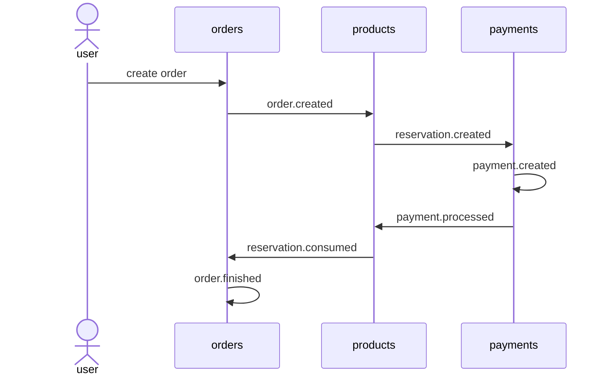
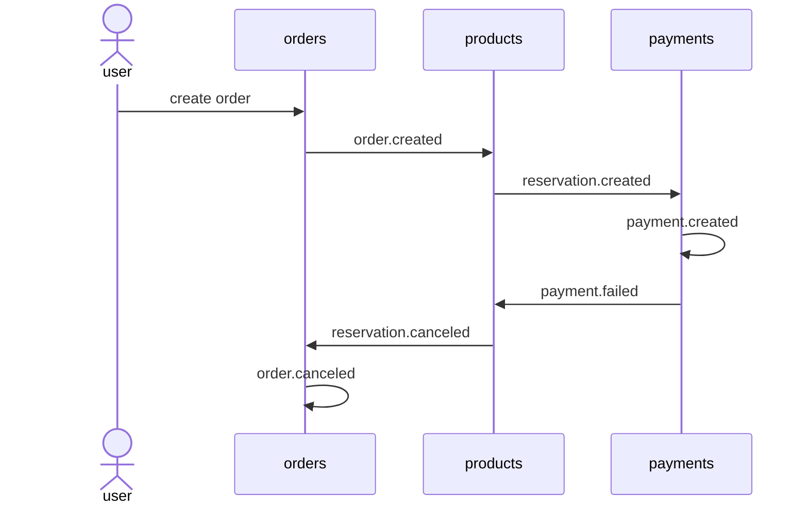
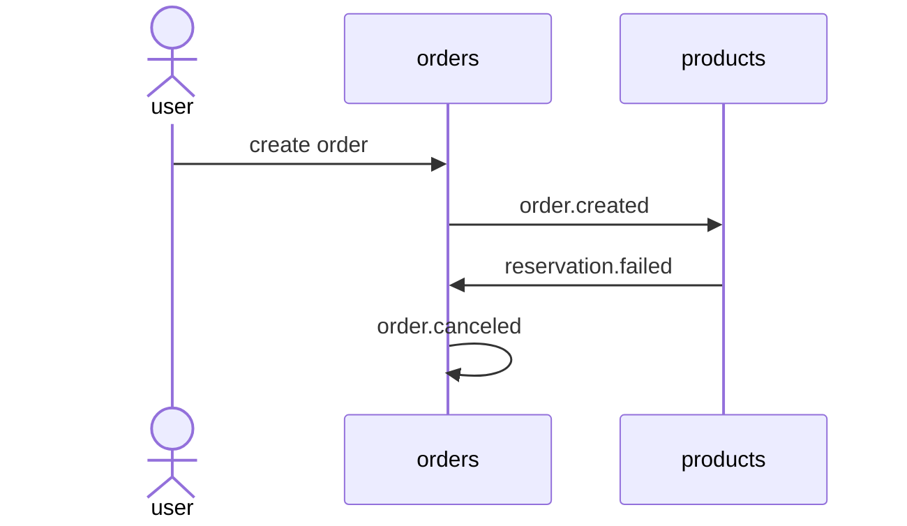

# Checkout example

## Description

This is an example of `distributed transaction` and `event driven design` on a `microservice architecture`.

## Architecture

The system is made of 3 microservices and a frontend application.

Each microservice has its own database, and it comunicates with other microservices mostly using events.

## Technologies

Backend:

- TypeScript
- Node.js + Express
- Drizzle

Frontend:

- React + Next.js
- Tailwind

Other:

- Docker
- RabbitMQ
- PostgreSQL

## Services

The system is made of 3 backend services (products, orders and payments), 1 message broker (rabbigmq) and 1 frontend service (frontend).

All the services are:

- products: Manages `products` and `reservations`
- orders: Manages `orders`
- payments: Manages `payments`
- products-db: database for products service
- orders-db: database for orders service
- payments-db: database for payments service
- rabbitmq: event broker using RabbigMQ
- frontend: client app

### products

- A `product` has a name and the amount in stock
- A `reservation` is created for each `order`'s item
- A `reservation` has a status of "created", "canceled" or "consumed"
- A `reservation` is consumed if the `order`'s `payment` is processed
- A `reservation` is canceled if the `order`'s `payment` fails, returning the amount of `products` to the stock

### orders

- Each `order` can have many items. Each item is an amount of a `product`
- An `order` has a status of "created", "canceled" or "finished"
- An `order` is canceled if the `reservation` or `payment` fails
- An `order` is finished when the `payment` is processed

### payments

- A `payment` is created for each `reservation`
- A `payment` has a status of "created", "processed" or "failed"
- A `payment` became processed or failed depending on the payment process
- For simulating failures, all `payments` with amount less than $1 fails

### products-db, orders-db, payments-db

- Each database is an instance of PostgreSQL

### rabbitmq

- RabbigMQ instance
- 3 queues, one queue for each service
- 1 exchange set as fanout

### frontend

- React + Next.js app

# Events

Most of services comunication is made using event. All events are sent to all services.

The events are:

- order.created
- order.canceled
- order.finished
- reservation.created
- reservation.consumed
- reservation.canceled
- reservation.failed
- payment.created
- payment.failed
- payment.processed

# Distributed transaction

When the user creates an order, it starts a process to reserve/consume the product's amount and execute the payment. If one step fails, the previous steps should be reverted.

This project handles the distributed transaction using a `choreography-based saga`. Each services publishes events that trigger local transactions in other services.

### Example 1 - successful order

If the payment runs successsfully, the reservations is consumed and the order is finished.



### Example 2 - order fails on payment process step

If the payment fails, the reservation and order are canceled.



### Example 3 - order is canceled due to lack of product in stock



## How to run

1. Use the `compose.dev.yaml` file to start all the services:

```
docker-compose -f "compose.dev.yaml" up -d --build
```

2. Open http://localhost:3000 on your browser
